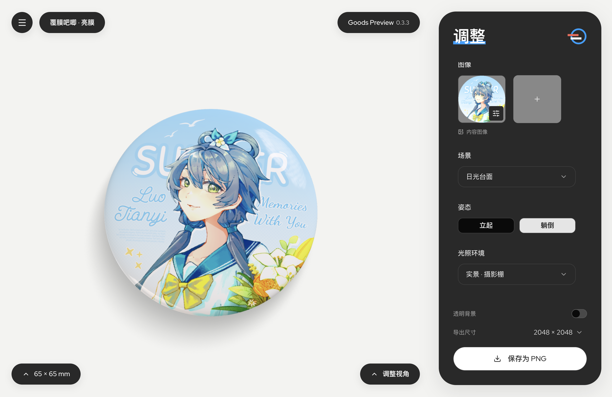

# Goods Preview

在线 3D 制品预览工具：选定制品、上传图案，实时查看立体效果并导出高分辨率 PNG。



在线使用：[goods-preview.a2x.im](https://goods-preview.a2x.im)

## 技术栈

- 界面：React 19 + TypeScript + React Router
- 构建：Vite
- 3D：three.js + @react-three/fiber
- 样式：Tailwind CSS 4 + shadcn/ui
- 规范：Biome
- 包管理：Bun

## 本地开发

需要 Node.js `^20.19.0 || >=22.12.0`（Vite 的版本要求）或 Bun。

```bash
bun install
bun run dev      # http://localhost:6420
```

| 脚本              | 说明                        |
| ----------------- | --------------------------- |
| `bun run dev`     | 开发服务器，端口 6420       |
| `bun run build`   | 类型检查并产出 `dist/`      |
| `bun run preview` | 本地预览构建产物，端口 6420 |
| `bun run lint`    | `biome check .`             |
| `bun run format`  | `biome format --write .`    |

## 贡献

如果你希望一起改进这个工具，欢迎贡献代码。但**完全由 AI 智能体自主完成，不经人类监督或不包含人类贡献成分**的 Pull Requests 或 Issue 将会被直接关闭。

## 许可

本工具的源代码根据 Apache 2.0 协议开放，见[LICENSE](./LICENSE)。
